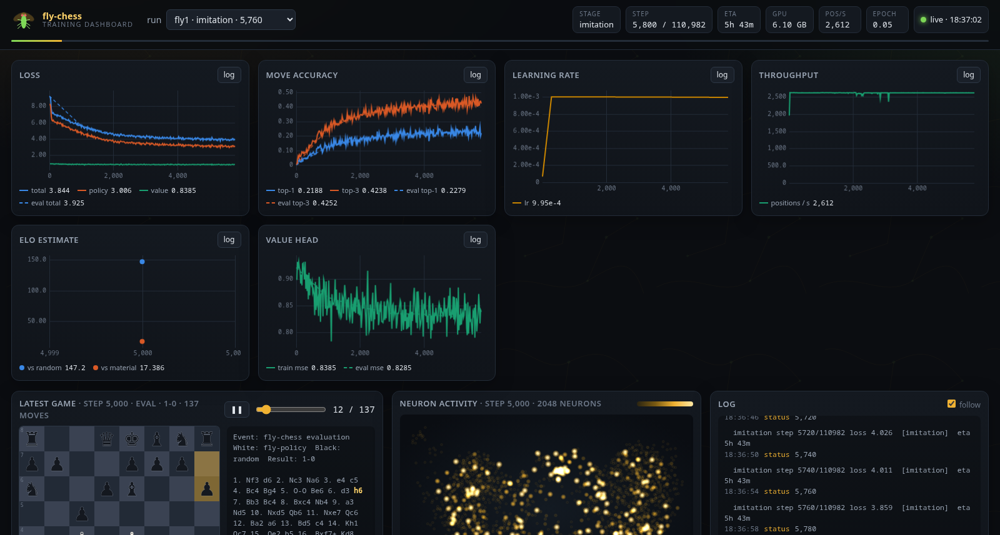

# fly-chess 🪰♟️

**A chess engine whose neural network is a fruit fly's brain.**

The player is a recurrent neural network with **134,209 neurons and 2,700,513 synapses** — not a
network *inspired* by a brain, but the actual wiring diagram of an adult *Drosophila melanogaster*
from the [FlyWire](https://flywire.ai) connectome (Dorkenwald et al. 2024, Schlegel et al. 2024).
Every synapse in the model exists in the fly; every synapse in the fly (above the 5-synapse threshold
of the public release) is in the model. The board is injected into the fly's sensory neurons, the
activity of its descending and motor neurons is read out as a move. Nothing else picks moves.

The same network runs in the browser — a hand-written sparse engine in plain JavaScript evaluates the
exported connectome, and a cross-language parity test guarantees it computes the same numbers as
PyTorch. You can play it at three strengths: **larva**, **fly** and **superfly**.

> Status: research toy, fully working pipeline. The fly is a weak chess player (see *How strong is
> it?*) — the point is that it is really the fly.

---

## Contents

- [How a connectome becomes a chess engine](#how-a-connectome-becomes-a-chess-engine)
- [Quickstart](#quickstart)
- [Architecture](#architecture)
- [Difficulty levels](#difficulty-levels)
- [The website: the same brain in the browser](#the-website-the-same-brain-in-the-browser)
- [Python API](#python-api)
- [Repository layout](#repository-layout)
- [Science credits and citations](#science-credits-and-citations)
- [Limitations](#limitations)
- [FAQ](#faq)
- [License](#license)

---

## How a connectome becomes a chess engine

FlyWire is a synapse-resolution electron-microscopy reconstruction of a whole adult fly brain. Its
public release (Codex snapshot 783) lists ~139k neurons, ~2.7M neuron-to-neuron connections (with the
number of synapses per connection), each neuron's neurotransmitter, cell class and 3-D position.

`fly build-brain` turns those tables into a **BrainGraph**: a sparse matrix in CSR form whose rows are
post-synaptic neurons and whose columns are pre-synaptic neurons. The model (`flychess/model/flybrain.py`)
then treats every neuron as a leaky rate unit:

```
h₀ = 0
for t in 1..T (T = 8):
    pre     = W · hₜ₋₁ + bias            W: the connectome, sparse (2.7M non-zeros)
    pre[in] += W_in · board + b_in       board planes injected into 2,048 sensory / ascending neurons
    hₜ      = (1 − a) ⊙ hₜ₋₁ + a ⊙ relu(pre)      a = sigmoid(leak) per neuron
policy = softmax(P · h_T[out])           1,415 descending + motor neurons → 4,168 move logits
value  = tanh(V · h_T[out])              … → expected result for the side to move
```

What is **fixed by biology** and what is **learned**:

| Component | Source | Learned? |
|---|---|---|
| Which synapses exist (2,700,513 pre→post pairs) | connectome | no — never |
| Sign of every synapse (Dale's law: ACh +, GABA −, glutamate −, monoamines +) | presynaptic neurotransmitter | no — never |
| Synapse strength magnitude (`w = sign · softplus(gain)`) | initialised from log(1 + synapse count) | yes |
| Per-neuron bias and leak (time constant) | init 0 / 0.5 | yes |
| Sensory projection `W_in` (board planes → 2,048 sensory neurons) | random init | yes |
| Motor read-out (`policy_head`, `value_head` on 1,415 descending/motor neurons) | random init | yes |

That is 11.9M trainable numbers for the full brain, 2.7M of which are synapse strengths whose sign
can never flip. The learned part is essentially "how strongly does each existing connection count"
plus how the board is shown to the fly and how its motor output is decoded. `SpMM` in
`flychess/model/spmm.py` is a custom autograd function (CSR forward, SDDMM backward on the same
pattern) so the 134k×134k matrix is never densified.

Training happens in two stages (SPEC §6):

1. **Imitation** — supervised on ~58M positions from Lichess 2014 (both players ≥ 1800 Elo):
   cross-entropy on the human move + MSE on the game result.
2. **Self-play** — batched PUCT MCTS with the fly as policy and value (Dirichlet noise at the root,
   temperature for the first 30 plies), replay buffer, periodic Elo against the previous iteration
   and against a random player.

## Quickstart

Requirements: Python ≥ 3.12, a CUDA GPU for the full brain (the 2000-neuron `--tiny` preset runs on
CPU), ~1 GB disk for the connectome tables, ~100 MB per month of Lichess games, Node ≥ 20 for the JS
tests (optional).

```bash
git clone https://github.com/cesp99/fly-chess && cd fly-chess
uv sync                       # or: pip install -e '.[dev]'
source .venv/bin/activate

fly download                  # FlyWire tables (~60 MB) into data/connectome/, Lichess 2014-01 into data/pgn/
fly build-brain               # data/brain/full.npz  (134k neurons, 2.7M synapses; ~1 min)
fly build-shards --months 2014-01 --workers 16      # data/shards/lichess-NNNNN.npz (shuffled positions)
fly train --run fly1          # stage 1 + stage 2 with configs/default.yaml semantics; Ctrl-C saves a checkpoint
fly dashboard --run fly1      # http://127.0.0.1:8765 — live loss / accuracy / Elo, latest game, neuron activity
fly play --run fly1           # terminal game against the fly (--difficulty larva|fly|superfly, --color black)
fly eval --run fly1 --games 50 --opponent random,material
fly export-web --run fly1     # web/model/brain.json + brain.flyb(.gz) + tests/vectors/model.json
fly play --gui                # serves web/ locally with the exported brain
scripts/deploy-pages.sh       # publish web/ to the gh-pages branch
```

Smoke everything in about a minute on the tiny graph:

```bash
fly build-brain --tiny
fly build-shards --months 2014-01 --max-games 3000 --workers 8 --name smoke --out /tmp/smoke-shards
fly train --run smoke --tiny --stage all --steps 60 --shards-dir /tmp/smoke-shards --shard-name smoke \
          --set selfplay_iters=2 --set selfplay_games_per_iter=4 --set mcts_sims=8
fly export-web --run smoke && node --test web/test/parity.test.mjs
```

`scripts/pipeline.sh` runs the whole real pipeline (download → brain → shards → train → export) with
sensible defaults; every step is idempotent and skips work that is already done.



*(`docs/dashboard.png` — dashboard screenshot; live charts of loss / top-k / Elo, the latest self-play
game replaying on a board and a heatmap of neuron activity at connectome positions.)*

### Configuration

`fly train` takes `--config cfg.yaml` (see `configs/default.yaml`, `configs/tiny.yaml`), the common
flags (`--steps`, `--batch-size`, `--lr`, `--graph`, `--shards-dir`, `--device`, `--resume`) and
`--set key=value` for any other `TrainConfig` field, including nested ones (`--set brain.steps=4`).
`--resume` continues from `runs/<run>/latest.pt` with the checkpoint's own config and warns about
drift. Everything lives under `FLYCHESS_HOME` (default: the repository) — `data/`, `runs/`.

## Architecture

```
  FlyWire tables ──► fly build-brain ──► BrainGraph (CSR, signs, in/out neuron sets)   data/brain/full.npz
  Lichess .pgn.zst ─► fly build-shards ─► shards (planes u8, move i16, value i8)       data/shards/*.npz
                                                    │
                                                    ▼
             ┌──────────────────────────── fly train ────────────────────────────┐
             │  stage 1 imitation        stage 2 self-play (batched MCTS, replay) │
             │  FlyBrain: board ──► W_in ──► [ 134k neurons, 2.7M synapses ]×8    │
             │                                  └──► policy (4168) / value (1)   │
             └───────────────► runs/<run>/{ckpt-N.pt, latest.pt, metrics.jsonl} ─┘
                                   │                       │
                   fly dashboard ◄─┘                       ├─► fly play (terminal / --gui)
                                                           ├─► fly eval (random, material, stockfish, other runs)
                                                           └─► fly export-web ──► web/model/brain.flyb(.gz)
                                                                                     │
                                          browser: engine/loader.js → flybrain.js → mcts.js (Web Worker)
                                          parity: tests/vectors/model.json == web/test/parity.test.mjs
```

Shared contracts live in [`docs/SPEC.md`](docs/SPEC.md): the board encoding (20 planes × 64 squares
from the side to move's perspective, 4,168 move indices), the checkpoint format, the metrics schema
and the `.flyb` binary format. The encoding is implemented twice (`flychess/chessenv/encoding.py`,
`web/engine/encoding.js`) and pinned by `tests/vectors/encoding.json`.

## Difficulty levels

All three use the fly brain exclusively — there is no fallback engine, no random-move stand-in.

| Level | How the move is chosen | Feel |
|---|---|---|
| **larva** | sample the legal-masked policy at temperature 1.2, no search | erratic, beatable |
| **fly** | argmax of the policy, then a 1-ply check: the top-3 candidates are played and the position the value head likes *least* for the opponent is kept | the fly's honest opinion |
| **superfly** | PUCT Monte-Carlo tree search, 200 simulations, every leaf evaluated by the brain | the same brain, thinking longer |

The value head also drives the fly's mood in the UIs (smug / confident / focused / nervous / panicking).

## The website: the same brain in the browser

`web/` is a static site (no build step, no CDN). `fly export-web` writes the trained network as
`brain.json` (header) + `brain.flyb` (little-endian blob: CSR indices, f16 synapse weights, biases,
leaks, input/output projections, 3-D neuron positions) and a gzipped copy. In the browser:

- `engine/loader.js` streams the `.gz` with a progress bar, gunzips it with `DecompressionStream`,
  caches the decoded buffer in the Cache API and creates typed-array views (f16 → f32 by lookup table);
- `engine/flybrain.js` runs the recurrence as a plain CSR sparse-matrix × vector loop — the same math
  as the PyTorch module, ~4 ms per timestep for 2.7M synapses;
- `engine/mcts.js` is the same PUCT search as Python for *superfly*;
- everything runs in a Web Worker; the page shows the board, the fly's mood, live neuron activity at
  connectome coordinates, commentary from the policy/value, a share card, a local leaderboard and a
  pass-and-play party mode.

**It is not a fake.** `fly export-web` also writes `tests/vectors/model.json`: reference logits and
values computed with numpy *from the exported f16 bytes* for 12 curated positions (black to move,
castling, both en passant captures, promotions, check, a repeated position). `node --test
web/test/parity.test.mjs` loads `web/model/` with the site's own loader and asserts the JS engine
matches within 1e-2 on every logit and value and picks the same best move; in practice the difference
is ~1e-7. The full brain is ~45 MB raw / ~30 MB gzipped.

## Python API

```python
import flychess

flychess.train("fly1", stage="all", config="configs/default.yaml", max_steps=200_000)
model, graph = flychess.load_brain("fly1")            # run name, run dir or checkpoint path
flychess.play("fly1", difficulty="superfly", color="black")
flychess.play("fly1", gui=True)                        # local website
```

Lower-level pieces: `flychess.play.FlyEngine(model, graph).choose_move(board, "fly")`,
`flychess.eval.evaluate_run(run, games, opponents)`, `flychess.export.export_web(model, graph, out)`,
`flychess.train.mcts.BatchedMCTS`, `flychess.connectome.graph.BrainGraph`.

## Repository layout

```
flychess/
  cli.py                 fly download / build-brain / build-shards / train / dashboard / play / eval / export-web / test-vectors
  connectome/            download FlyWire tables, parse them, select the subgraph, build the CSR BrainGraph
  chessenv/              board → planes, move ↔ index, ChessEnv, encoding test vectors
  model/                 FlyBrain (recurrent connectome net), custom sparse SpMM autograd, BrainConfig
  data/                  Lichess streaming parser + shard writer, ShardDataset
  train/                 TrainConfig, imitation stage, batched MCTS, self-play stage, trainer, metrics logger
  eval/                  RandomPlayer, GreedyMaterialPlayer, optional Stockfish, Elo matches
  play/                  FlyEngine (difficulties), rich terminal UI, local web server
  dashboard/             FastAPI + websocket dashboard tailing metrics.jsonl
  export/                .flyb exporter, numpy reference forward, cross-language test vectors
web/                     static site: engine/{loader,flybrain,mcts,encoding,worker}.js, board UI, tests
configs/                 default.yaml (full brain), tiny.yaml (smoke)
scripts/                 pipeline.sh, serve-web.sh, deploy-pages.sh
tests/                   pytest suite (fast: tiny graph / toy graph), tests/vectors/*.json
docs/SPEC.md             the contract every module follows
```

Tests: `python -m pytest -q` (≈25 s, CPU or GPU), `node --test web/test/*.mjs`, `ruff check flychess tests`.

## Science credits and citations

- **FlyWire connectome** — Dorkenwald, S. *et al.* Neuronal wiring diagram of an adult brain.
  *Nature* 634, 124–138 (2024). https://doi.org/10.1038/s41586-024-07558-y
- **Cell types and annotations** — Schlegel, P. *et al.* Whole-brain annotation and multi-connectome
  cell typing of *Drosophila*. *Nature* 634, 139–152 (2024). https://doi.org/10.1038/s41586-024-07686-5
- FlyWire data (Codex snapshot 783, https://codex.flywire.ai) is released under
  **CC BY-NC 4.0**; the Zenodo mirror (10.5281/zenodo.10676866) under CC BY 4.0. The FlyWire consortium
  and the hundreds of proofreaders who built the reconstruction deserve the credit for the brain.
- **Neurotransmitter signs** follow Eckstein, N. *et al.* Neurotransmitter classification from
  electron microscopy images at synaptic sites in *Drosophila melanogaster*. *Cell* 187 (2024);
  glutamate is treated as inhibitory (GluCl) as is standard for the fly CNS.
- **Games** — the [Lichess open database](https://database.lichess.org) (CC0).
- **chess.js** (BSD-2-Clause) for move generation in the browser; **python-chess** (GPL-3.0, used as
  a library at training time) on the Python side.

If you use this in research, please cite the FlyWire papers above; this repository is a
demonstration built on their work.

## Limitations

- **Not a strong engine.** A recurrent net with 8 timesteps, a random-initialised sensory projection
  and fixed connectivity is a poor architecture for chess. After imitation on 2014 Lichess it plays
  plausible openings and blunders in tactics; superfly's search helps but the value head is weak.
- **The connectome is a graph, not a simulation.** Rate units, one leak per neuron, no gap junctions,
  no neuromodulation, no dendritic computation, a fixed 8-step unroll. Synapse *counts* seed the
  initial strengths but the trained strengths are whatever gradient descent wants (with sign fixed).
- **Input/output neuron choice is a modelling decision**: the board goes into the 2,048 sensory /
  ascending neurons with the most outputs, the move is read from the 1,415 descending / motor neurons.
  A fly has no chess-board sensory organ; `W_in` is where most of the "chess" is learned.
- **Data**: only rated Lichess games ≥ 1800 from 2014; the self-play stage is short by AlphaZero
  standards (hours, not months).
- **Browser**: the full brain is a 30 MB download and ~35 ms per forward pass; superfly takes several
  seconds per move on a laptop.
- **FlyWire data is CC BY-NC 4.0** — the exported brain and anything derived from it are for
  non-commercial use.

## FAQ

**Is it really the fly?** Yes, in the sense that the network's connectivity graph and synapse signs
are the FlyWire adult connectome, unchanged — no synapse is added, removed or re-signed by training.
No, in the sense that the *dynamics* are a simple rate model, the strengths are learned, and the
board input and move read-out are new learned projections. `docs/SPEC.md §0` is the formal promise:
the fly brain is the only thing that picks moves, in Python and in the browser, verified by the
parity test.

**How strong is it?** Weak. Measure your own run with `fly eval --run <name>` (random and 1-ply
material opponents ship with the repo; add `--opponent stockfish:1` if a Stockfish binary is on your
PATH). The dashboard tracks Elo over training. Expect it to beat a random mover comfortably after
imitation and to lose to any real engine.

**Why a fly?** It is the largest whole-brain connectome available at synapse resolution with
neurotransmitter labels, and it fits on one GPU: 134k neurons × 2.7M synapses is small enough to
train and to ship to a browser.

**Can I use a different brain?** `fly build-brain --region central` drops the optic lobes (~50k
neurons); `--max-neurons N` keeps the N most connected neurons (always keeping the sensory and
descending sets). Any `BrainGraph` npz with the SPEC §2.3 arrays works.

**Does the browser really run the network, or does it call a server?** It runs it: `web/` is static
files, the worker executes `flybrain.js` on the downloaded blob. Open the network tab — after the
model download there are no requests.

## License

The code in this repository is released under the **MIT License** (see [`LICENSE`](LICENSE)),
© 2026 Carlo Esposito. The FlyWire data and the exported brain models derived from it are subject to
the FlyWire terms (CC BY-NC 4.0); the Lichess games are CC0; `web/vendor/chess.js` is BSD-2-Clause.
